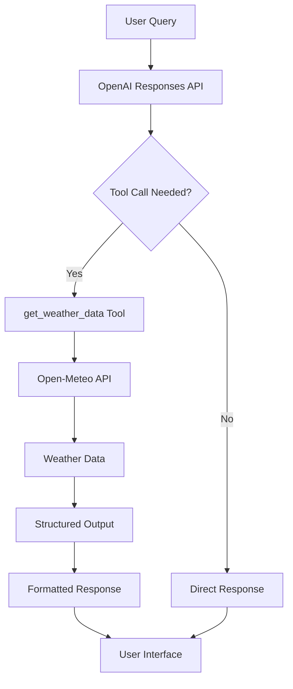

# Weather App - OpenAI Responses API Demo

This weather app demonstrates the power of OpenAI's new Responses API combined with tool calling and structured outputs.

## Features

### 🌤️ **AI-Powered Weather Queries**
- Ask about weather using natural language
- No need to specify exact coordinates or formats
- Intelligent location extraction from queries

### 🔧 **Tool Calling Integration**
- Automatic API calls to Open-Meteo weather service
- Real-time weather data fetching
- Seamless integration between AI and external APIs

### 📊 **Structured Outputs**
- Consistent weather data formatting
- AI-generated recommendations and insights
- Type-safe data structures

## How It Works

1. **Natural Language Processing**: Users ask questions like "What's the weather in Paris?"
2. **Tool Calling**: AI automatically calls the `get_weather_data` tool with extracted location
3. **Data Fetching**: Tool fetches real-time weather from Open-Meteo API
4. **Structured Response**: AI formats the data with recommendations and insights

## API Endpoints

### `POST /api/weather`

**Request:**
```json
{
  "query": "What's the weather in Paris?"
}
```

**Response:**
```json
{
  "success": true,
  "data": {
    "weather_data": {
      "location": "Paris",
      "temperature": 22,
      "temperature_unit": "celsius",
      "condition": "partly cloudy",
      "humidity": 65,
      "wind_speed": 12,
      "wind_unit": "kmh",
      "wind_direction": 180,
      "pressure": 1013,
      "pressure_unit": "hPa",
      "visibility": 10,
      "visibility_unit": "km",
      "uv_index": 5,
      "feels_like": 24,
      "description": "Current weather in Paris: partly cloudy with temperature of 22°C",
      "timestamp": "2024-01-15T10:30:00.000Z"
    },
    "summary": "Pleasant weather with partly cloudy skies",
    "recommendations": [
      "Light jacket recommended",
      "Good conditions for outdoor activities",
      "UV protection advised"
    ],
    "additional_info": "Weather conditions are stable with moderate humidity."
  }
}
```

## Example Queries

- "What's the weather in Paris?"
- "How's the weather in New York City?"
- "Tell me about the weather in Tokyo"
- "Weather forecast for London"
- "Is it raining in San Francisco?"
- "Current weather in Sydney, Australia"

## Setup

1. **Environment Variables**: Add your OpenAI API key to `.env.local`:
   ```
   OPENAI_API_KEY=your_openai_api_key_here
   ```

2. **Install Dependencies**:
   ```bash
   npm install
   ```

3. **Run Development Server**:
   ```bash
   npm run dev
   ```

4. **Visit**: `http://localhost:3000/weather`

## Technologies Used

- **Next.js 14** - React framework with App Router
- **OpenAI Responses API** - New API for structured responses
- **Tool Calling** - Function calling capabilities
- **Structured Outputs** - JSON schema validation
- **Open-Meteo API** - Free weather data service
- **shadcn/ui** - Beautiful UI components
- **Tailwind CSS** - Utility-first styling
- **TypeScript** - Type safety

## API Architecture



This demonstrates the complete flow of modern AI applications using OpenAI's latest APIs!
